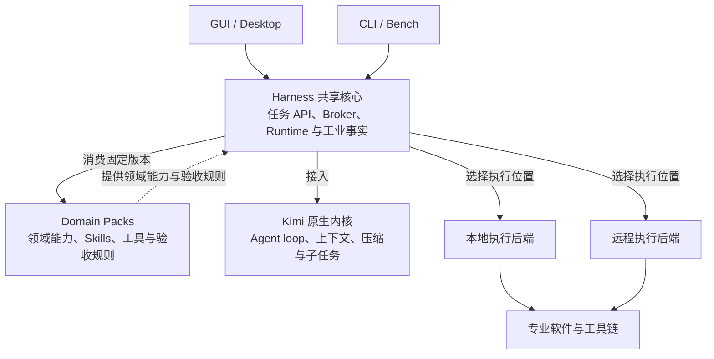

# 系统架构

Industrial Agent Harness 是共享的工业任务核心，GUI / Desktop 与 CLI / Bench 是它的两个产品入口。领域能力由独立维护、固定版本的 Domain Packs 提供；本地或远程执行是另一条独立的选择。第一阶段使用 Kimi Code 作为指定 Agent Kernel。

本文按 2026-10-08 最新实现更新。开发约束以[已接受的架构契约 IH-ARCH-001](architecture-contract.md)为准；共享任务服务与领域源码消费的迁移证据见[实施记录](shared-task-and-pack-consumption.md)。职责边界适用于后续开发，具体领域、平台和执行环境的可用范围仍须分别验收。

## 总体关系



图中的“共享核心”表示 Harness 的产品职责集合，包含共享应用层、Broker、Pack 加载、Kimi 接入与通用 Runtime；它不等同于单个 `harness-core` 包。规范工业契约和通用 Core 保持独立，不依赖 Kimi、Electron 或具体领域实现。

CLI / GUI 不决定本地 / 远程执行。两种入口均通过共享配置和 Runtime 选择执行位置；领域版本、执行 profile 和客户端平台是否支持某个组合，以对应的验收证据为准。当前远程接入范围见[内置远程运行](remote-execution.md)。

## 职责边界

| 部分 | 应负责什么 |
| --- | --- |
| Harness 共享核心 | 项目、配置、Scope、审批、资源策略、任务编排，以及统一 Project / State / Run / Action / Artifact / Verification / Checkpoint；负责 Broker、Pack 加载与 Kimi 接入 |
| Domain Packs | 领域状态读取、能力声明、Skills、工具实现、输入规则、Verifier 与验收规则、依赖锁和执行环境配方，以及已验收的执行 profile |
| CLI | 参数、输入输出、信号处理和批量运行；通过共享任务 API 完成任务 |
| GUI / Desktop | 交互、项目选择、审批与问题展示、文件和工程证据查看；通过同一共享任务 API 完成任务 |
| 执行后端 | 进程 / 容器 / 沙箱启动、取消、资源限制与确认清理；远程服务另负责认证、快照、授权和有限调度 |
| Kimi 原生内核 | Agent loop、对话上下文、压缩、原生持久化与子任务生命周期；Harness 负责接入固定版本的上游内核 |

Broker 从当前 Domain State 与任务解析能力，关联 Skill Batch、Tool Scope 和 Verifier，并记录披露与 Scope 变化。Skill 和工具按需披露；工具范围在执行边界再次检查，披露过工具不代表已获执行授权。

Harness 通过 Kimi Integration 传递有限的 Industrial Context，转换事件和审批响应，衔接会话与任务生命周期。Kimi 继续管理原生循环、上下文、压缩和子任务。工业事实的类型与存储不引入 Kimi 专属类型，Core 和 Broker 不包含 Chip、PCB 等具体领域规则。

Domain Packs 在 [industrial-domain-packs](https://github.com/Zhiman-BJ/industrial-domain-packs) 维护。Harness 消费经过审查的不可变发布身份，并校验版本、内容摘要、Core 契约兼容性、Tool / Verifier 身份、依赖和执行 profile。随安装包分发或缓存的资源是消费副本；领域修复在所属仓库完成，再更新 Harness 的固定依赖。源码归档本身不能证明安装后的原生环境已通过验收。

Viewer Core / Registry 根据有来源的 Artifact 选择只读显示方式。GUI 展示文件和证据；Viewer 的渲染结果、显示缓存和界面状态不能更新 DomainState 或验证结论。详细边界见[Viewer 层设计](viewer-layer.md)。

## 两种 CLI 与 MCP

| 入口 | 定位 | 集成时的边界 |
| --- | --- | --- |
| Harness CLI | 产品入口，供用户或 Bench 提交任务、审批、取消、恢复和读取证据 | 调用共享 Harness 任务 API，保持与 GUI 相同的 Scope、授权、动作记录和验证语义 |
| Pack 自带的 EDA CLI 等工具 | 领域工具或服务入口，可供 Pack 独立开发与验收 | 在 Harness 中调用时，经当前项目和 Scope 约束进入 Runtime；工程变更须进入审批、Action 记录和验证链路 |

两个产品入口不能互相导入或驱动对方实现；Bench 直接使用 Harness CLI / 共享 API。Pack 工具可以独立运行，但其独立运行结果要成为 Harness 工程事实，仍需按规范契约和证据链校验。

MCP 负责连接、调用协议与工具披露，工程结论由领域 Verifier 和共享 Runtime 建立。MCP 调用成功、进程退出码为零、Agent 回答完成或 Viewer 显示成功，都不能单独证明工程验收通过。

## 工业任务闭环

```text
项目与 Domain State → 当前任务 → Broker 解析能力与 Scope
→ Skill Batch + Tool Scope → Kimi 决策与调用
→ Runtime 重查 Scope / 当前 State / 审批 → 执行后端运行领域工具
→ Action + Artifact + 领域 Verification → 新 Domain State
→ Checkpoint / 历史证据 → 接受、修复或继续任务
```

Action 的执行状态、Verifier 的验证结论和用户对结果的接受分别记录。失败或中断也保留真实输入、诊断、显式产物集（可为空）与验证状态；没有运行验证的操作明确记为 `not_run`，界面或适配器不自行补出“通过”。

## 当前实现与仓库映射

| 职责 | 当前实现 |
| --- | --- |
| 产品入口 | `apps/desktop` 与 `apps/cli` |
| 共享任务应用层 | `packages/harness-application` 的 `TaskService`：prepare / start / approve / answer / cancel / resume / history / evidence / diagnose / close |
| 项目、策略、能力与规范工业事实 | `packages/harness-core`、`packages/capability-broker`、`packages/contracts`、`packages/domain-runtime` |
| 固定 Pack 消费、安装与披露 | `packages/pack-manager`、`packages/domain-skills`、`packages/domain-mcp`；领域声明和实现来自固定版本的外部 Domain Packs |
| 原生 Agent 接入与只读显示 | `packages/agent-kimi`、`packages/viewer-core`、`packages/viewer-builtin` |

CLI 与 Desktop 已共同使用 `TaskService`。Broker 状态重解析、原生 Kimi 会话接入、聊天持久化、上下文观察、Pack / 聊天 / 资源租约、工具结果后的 Scope 更新、后台任务等待与关闭清理由该服务统一处理。Desktop 保留 IPC、项目选择与事件展示；CLI 保留参数、JSONL、模型配置、信号和退出码。任务开始时会在取得租约后重新检查状态与策略，prepare 得到的 Scope 不构成永久执行权限。

Harness 中原有领域源码、Skills、清单和专用发布器已移除，通用分发流程消费领域仓库的固定内容。`packages/domain-skills` 只维护通用 `project.work`，其余领域资源由加载器从固定 Pack 获取。实现记录列出固定版本、迁移范围和验证结果；架构契约中的迁移缺口段落保留接受时的历史基线。

共享路径已有真实文件 Action / Verification 对照、失败清理、聊天归属、原生后台租约和关闭期间任务准备的测试；现有原生 Kimi、桌面、工业工具与安装验收继续约束生产路径。共享入口与源码归属的迁移已完成，全领域和所有 GUI / CLI × 本地 / 远程组合的行为一致性仍按领域、平台及 profile 验收。当前里程碑和剩余例外见[Prototype Register](prototype-register.json)及[Definition of Done](04-definition-of-done-and-architecture-tests.md)。

## 其他扩展边界

领域扩展点分为 Tool、Bridge、Viewer 和 Verifier。Tool 执行动作，Bridge 连接专业软件，Viewer 展示产物和状态，Verifier 按领域规则评价结果。优先使用专业软件的原生 API、CLI 或 IPC；CAD、Godot 等复杂软件在内部展示关键产物，不重建完整编辑器。

Harness 还支持应用级横切插件（ADR-005），例如 `packages/computer-use-bridge`。这类插件通过 Kimi 会话 `externalTools` 注册，handler 保留在 Harness 执行边界，审批在启用期间按会话自动批准；它不进入 Domain Pack、Capability 解析或 Broker Scope。computer-use 调用尚未进入 Domain Runtime 的 Action / Verification 记录，该已有缺口登记在 Prototype Register，不能作为领域工具绕过规范链路的模式。
