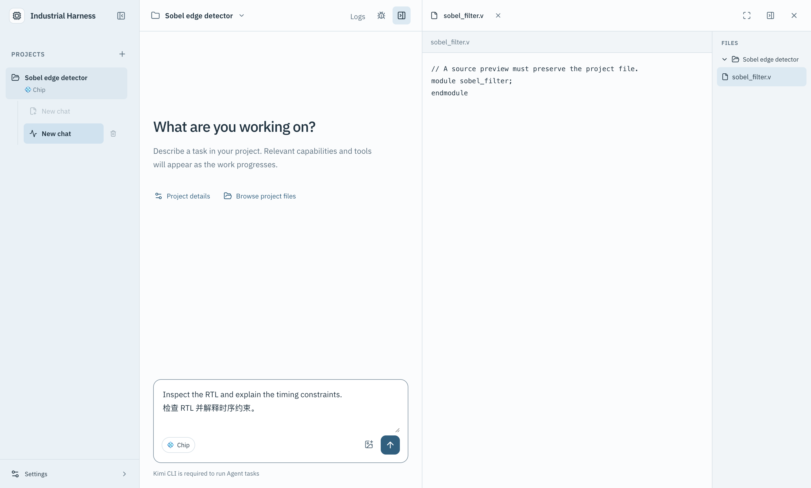
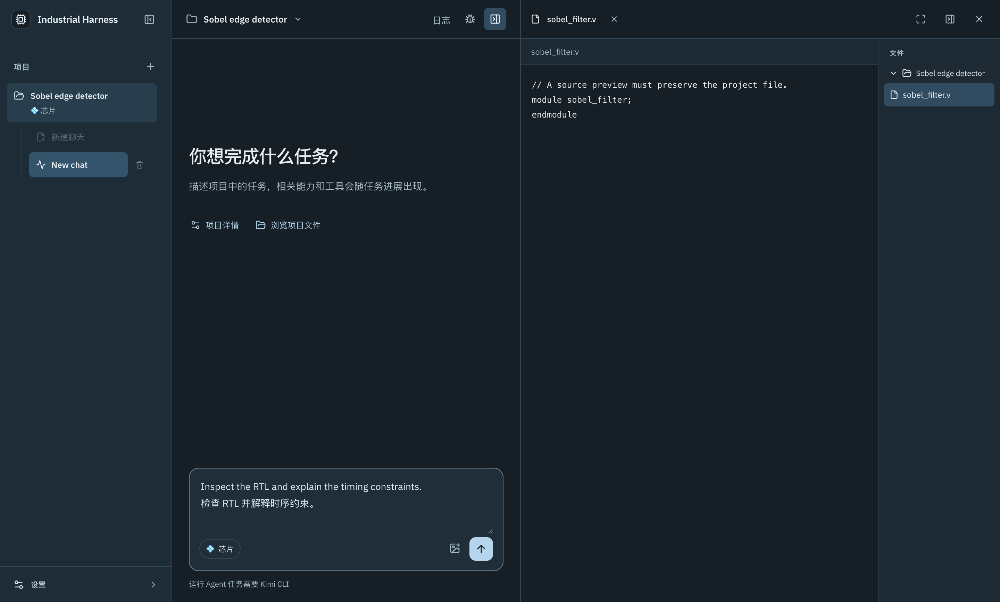

# Desktop UI refinement with Impeccable

2026-10-05. This change refines the existing engineering workbench using the
[Impeccable](https://impeccable.cn/#downloads) Operate and polish guidance.
The source guidance was inspected at upstream revision
`ece38d9904b8a619b3f77cab476eacad09c4fb11`; the detector used engine 0.1.11.

The desktop keeps its project/chat sidebar, conversation, and collapsible file
workspace. The changes clarify navigation selection, improve reading density,
give project creation and file browsing a direct entry, expose New chat on the
first screen of project details, and unify light/dark colors and keyboard focus.
It adds no industrial execution or verification behavior.

The [desktop design reference](../apps/desktop/DESIGN.md) records tokens,
typography, density, responsive rules, and interaction states. IBM Plex Sans is
self-hosted (45.7 kB) with its complete license and provenance retained in desktop
staging; the application makes no external font request.

## Verification scope

- Build/typecheck, architecture gates, and desktop unit tests.
- The actual Electron project-creation → project details → new chat → file tree
  → source preview path, plus light/dark contrast, local font loading, Chinese/
  English, 1440 × 900, 1250 × 800, 1000 × 720, and 1000 × 650 windows, input
  focus, Shift+Enter, and draft retention.
- Existing language and document Viewer selftests, plus parallel chat, approval,
  stop isolation, renderer restoration, and logs/resource Viewer regressions.
- Impeccable's mechanical scan of `src/App.tsx` and `src/style.css` returned no
  findings. This is a source check; visual inspection and interaction checks are
  separate evidence.
- Font license/provenance shipping through `copyDesktopNotices`.

UI selftest data is an isolated temporary RTL project. It does not run a model,
claim engineering acceptance, or modify a user's project. Local runtime checks
cover macOS arm64. Packaged installers, Windows runtime behavior, and production
release rollout are outside this change's verification scope.

Run after `pnpm build`:

```sh
pnpm --filter @industrial-agent-harness/desktop test:ui
pnpm --filter @industrial-agent-harness/desktop test:language
pnpm --filter @industrial-agent-harness/desktop test:documents
pnpm --filter @industrial-agent-harness/desktop test:parallel
pnpm --filter @industrial-agent-harness/desktop test:logs
```

Set `INDUSTRIAL_UI_SCREENSHOTS` to an output directory to retain the native
screenshots from `test:ui`.

## Native screenshots

These captures use the isolated UI selftest project, with an unsent draft and an
unmodified source file. They demonstrate the implemented shell and source
workspace, not a completed engineering run.




