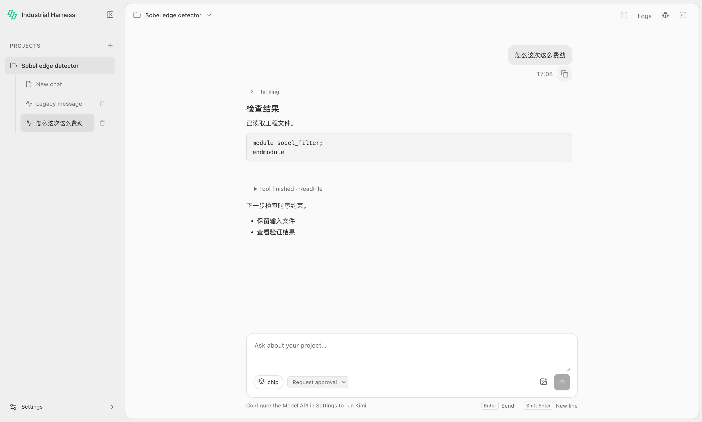
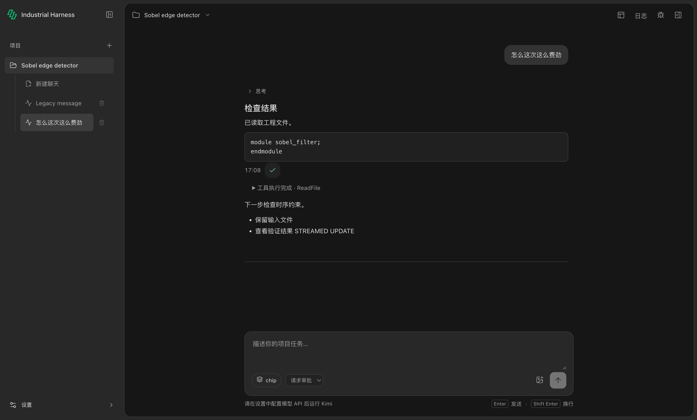
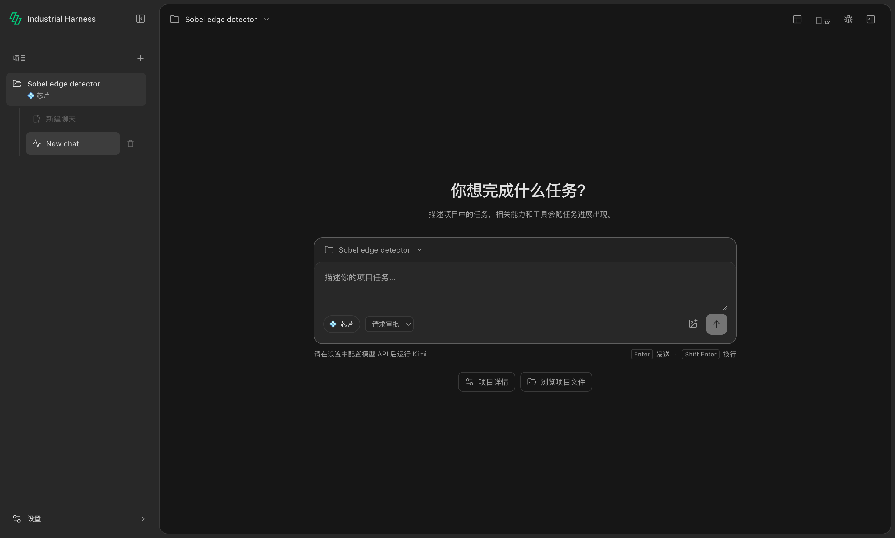
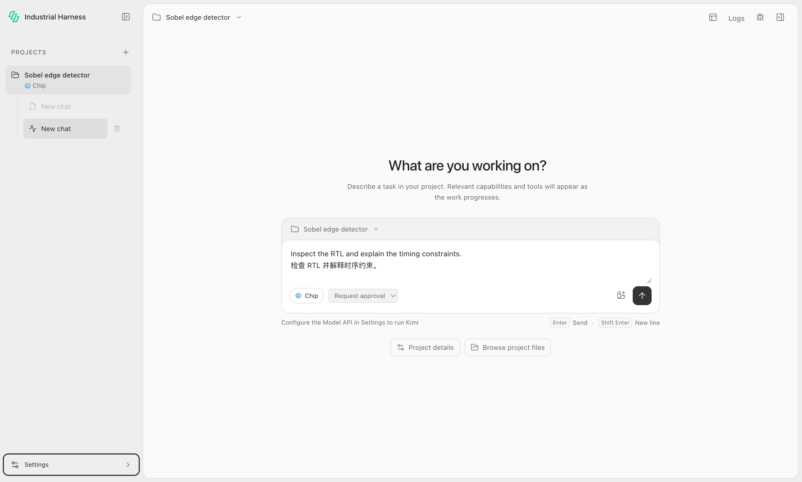

# Desktop UI refinement with Impeccable

2026-10-05. The initial refinement below is a historical record; the current
visual direction is the neutral redesign recorded at the end of this document.
The initial change refines the existing engineering workbench using the
[Impeccable](https://impeccable.cn/#downloads) Operate and polish guidance.
The source guidance was inspected at upstream revision
`ece38d9904b8a619b3f77cab476eacad09c4fb11`; the detector used engine 0.1.11.

The desktop keeps its project/chat sidebar, conversation, and collapsible file
workspace. The changes clarify navigation selection, improve reading density,
give project creation and file browsing a direct entry, expose New chat on the
first screen of project details, and unify light/dark colors and keyboard focus.
It adds no industrial execution or verification behavior.

The [desktop design reference](../apps/desktop/DESIGN.md) records tokens,
typography, density, responsive rules, and interaction states. IBM Plex Sans is
self-hosted (45.7 kB) with its complete license and provenance retained in desktop
staging; the application makes no external font request.

## Verification scope

- Build/typecheck, architecture gates, and desktop unit tests.
- The actual Electron project-creation → project details → new chat → file tree
  → source preview path, plus light/dark contrast, local font loading, Chinese/
  English, 1440 × 900, 1250 × 800, 1000 × 720, and 1000 × 650 windows, input
  focus, Shift+Enter, and draft retention.
- Existing language and document Viewer selftests, plus parallel chat, approval,
  stop isolation, renderer restoration, and logs/resource Viewer regressions.
- Impeccable's mechanical scan of `src/App.tsx` and `src/style.css` returned no
  findings. This is a source check; visual inspection and interaction checks are
  separate evidence.
- Font license/provenance shipping through `copyDesktopNotices`.

UI selftest data is an isolated temporary RTL project. It does not run a model,
claim engineering acceptance, or modify a user's project. Local runtime checks
cover macOS arm64. Packaged installers, Windows runtime behavior, and production
release rollout are outside this change's verification scope.

Run after `pnpm build`:

```sh
pnpm --filter @industrial-agent-harness/desktop test:ui
pnpm --filter @industrial-agent-harness/desktop test:language
pnpm --filter @industrial-agent-harness/desktop test:documents
pnpm --filter @industrial-agent-harness/desktop test:parallel
pnpm --filter @industrial-agent-harness/desktop test:logs
```

Set `INDUSTRIAL_UI_SCREENSHOTS` to an output directory to retain the native
screenshots from `test:ui`.

## Native screenshots

These captures use the isolated UI selftest project, with an unsent draft and an
unmodified source file. They demonstrate the implemented shell and source
workspace, not a completed engineering run.


## Message actions and product mark (2026-10-08)

The initial message-action change was based on main `62c1714`; the redesign
incorporates `2482114` and subsequently merged current main `91cd252`. Messages
provide their time and a Copy button
on hover, without clicking to reveal them. The row also appears on keyboard
focus, and remains visible on devices without hover. User controls align below
the right edge of the bubble; assistant controls align with the reply. Reserved
space prevents movement on hover. Copy shows a brief check/accessible success
message; failures show a localized retry action. Assistant copies preserve the
body's Markdown source, excluding leading reasoning and tool/interface text.
The chat approval select added in current main also uses shell theme tokens,
preventing inherited Viewer styles from giving it a dark fill in the light theme.
Its displayed text is included in native contrast checks in both themes.

User times use the stored turn creation time. New events gain host receipt
metadata through the shared ChatStore; both the stored read model and live IPC
use that field. Stream coalescing keeps the first receipt time. Older replies
without receipt metadata omit time instead of inventing one at load. This is
display metadata, not an industrial execution/verification timestamp, and it
does not change Kimi's native context or persistence.

Core identity now uses the user's supplied green mark. In response to review,
the sidebar uses a transparent derivative, and the native app icon uses balanced
inner whitespace and a rounded backing. The original PNG and built-in imagegen
edit prompts are kept in [branding](../apps/desktop/branding/README.md).
Committed PNG/ICO formats cover the sidebar, favicon, Dock/window, macOS app,
and Windows app/NSIS installer, uninstaller, and header configuration.

Verified locally on macOS arm64:

- `pnpm build`; 29 Harness core, 34 desktop, 12 SDK, 17 CLI, and 12 architecture
  tests passed.
- Native `test:messages` covers actual mouse hover, unchanged layout, exact
  system-clipboard contents, Markdown body-only copy, keyboard Enter,
  localized failure/retry, live stream timestamps, old history, chat switching,
  renderer reload, both themes/languages, 1000 × 650 layout, and local brand
  asset loading. It restores all native clipboard formats after the test.
- Existing `test:ui`, `test:language`, and `test:parallel` passed, including
  onboarding, file preview, font/contrast checks, IME, draft retention, approval,
  stop/question isolation, and concurrent renderer restoration.
- An unsigned macOS arm64 application directory was built with the custom
  1024 px ICNS icon. Its packaged `--messages-selftest` passed through the
  actual `app://viewer` renderer, including native hover and clipboard checks.
  The isolated fresh Core fixture closes the real Domain onboarding dialog
  before checking message hit targets; it installs no Domain packs.
- Impeccable context/polish guidance and one source detector scan over App,
  AgentFlow, MessageActions, and shell CSS. The scan reported one existing
  neutral Markdown blockquote border, retained as semantic quotation styling;
  it is outside the added message-control styling. Native visual checks remain
  separate from this mechanical scan.

Windows runtime and NSIS installation remain unverified in this change.
Local application builds use no production signing/notarization or rollout.

Run after `pnpm build`:

```sh
pnpm --filter @industrial-agent-harness/desktop test:messages
```

The captures below are isolated UI fixtures, not an actual model/engineering
run. Native clipboard tests never copy data from an existing user project.





## Neutral workbench redesign (2026-10-08)

The user requested a substantial overall restyle following their supplied
desktop screenshot, with lighter type and tighter leading, and explicitly
asked to preserve the existing theme preference. The branch incorporates main
`91cd252`, including IH-ARCH-001, project execution location, per-chat approvals,
and the responsive tab workbench. This work changes the desktop presentation and reuses existing
actions; it adds no orchestration and changes no frozen Domain implementation.

Both themes now use neutral surfaces and fine separators. The dark conversation
canvas is `#161616`, navigation `#282828`, composer header `#222222`, and input
surface `#282828`. The light theme uses the same hierarchy with light gray
surfaces. The system UI font precedes the existing bundled fallback; normal
body text is 400, headings generally 500, and conversation/input text is
13 px with 1.6 line height. Headers are 48 px, and the main reading/composer
measure is 680 px. Source code remains monospace.

On an empty chat, the greeting and composer form a centered group. The composer
context opens existing project details or project creation, and existing
welcome actions sit below it. After submission, the composer stays at the
bottom as before. The three work areas, collapsible panels, settings location,
green core identity, hover-only message actions, and stored theme preference
remain available. Main's file/chat tabs, saved layout preference, <900 px tab
fallback, and <760 px sidebar drawer also remain. The native minimum is now
640 × 480, clamped to smaller work areas. Empty-chat spacing tightens below
600 px of content height so the welcome title and input stay visible; the
accessible keyboard description remains when the visual hint is hidden.
No unrelated reference-app branding, models, or tasks were added.

The Impeccable source guidance at the revision above was applied with the user
reference as the pinned direction. Confirmed product context is in `PRODUCT.md`;
the recorded surface brief and desktop design document describe the resulting
contract. An independent finish reviewer inspected actual native captures at
normal and minimum window sizes, requested one consistent close-icon fix, and
accepted the recaptured correction. The earlier single source scan was not
rerun; its neutral blockquote border is now 1 px. Source scan and native visual
review remain separate evidence.

Verified locally on macOS arm64 after the restyle:

- Build/typecheck; 42 desktop and 23 architecture tests, including the
  architecture-contract checker and its 11 negative policy regressions.
- Harness core 29, SDK 12, CLI 17 and Kimi adapter 70 tests passed on the final
  merged branch; 2 platform-dependent Kimi tests were skipped.
- All 9 existing native industrial-core integration tests passed, including
  the signed installed Chip Pack, real Verilator, cancellation/failure and
  pinned Kimi CLI path. This checkout has no local EDA virtual environment;
  the gate used the existing workspace EDA Python through the supported
  `INDUSTRIAL_HARNESS_EDA_PYTHON` setting. No Domain source was changed.
- Native `test:ui` and `test:messages`, including normal/minimum layouts,
  Chinese/English, both themes, contrast, centered empty chat, project/file
  navigation, input focus and draft retention, body-to-button mouse hover,
  exact clipboard contents, copy/retry, timestamps, history and reload.
- Main's tab navigation/layout persistence, retained document DOM, and
  800 × 600 / 640 × 480 matrix passed, including a direct assertion that the
  empty-chat heading stays visible at the native minimum.
- Native `test:language`, `test:parallel`, and `test:images`, preserving IME,
  concurrent chat/approval/question/stop isolation, and image selection,
  paste/drop, model capability, draft isolation, and error retry.
- Native `test:gui-settings` passed the main branch's desktop-operation switch,
  permission-status, unknown/error and bounded settings-link checks.
- An unsigned macOS arm64 application directory built from the final renderer
  passed its packaged `--messages-selftest` through `app://viewer`. The native
  pointer helper waits for scrolling/layout before targeting the message, then
  checks hover and visible actions before clicking Copy. Its isolated fresh
  Core closes Domain onboarding and installs no Domain packs. This verifies
  the packaged UI path, not installation or engineering execution.

Windows runtime/NSIS installation, production signing/notarization, and release
rollout remain outside this change's verification scope.

The screenshots below are real Electron captures of isolated UI fixtures. They
do not represent a model run or engineering verification.




