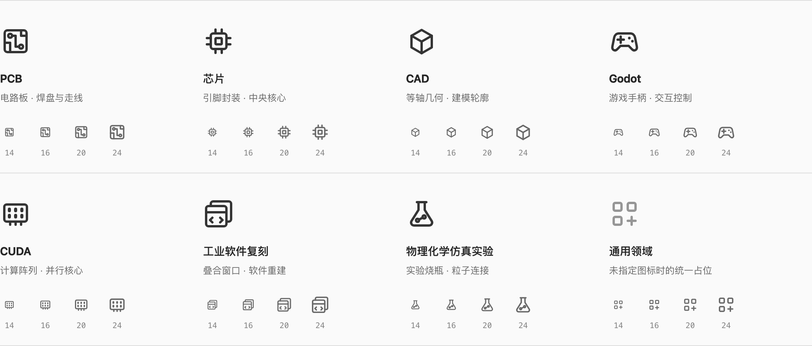
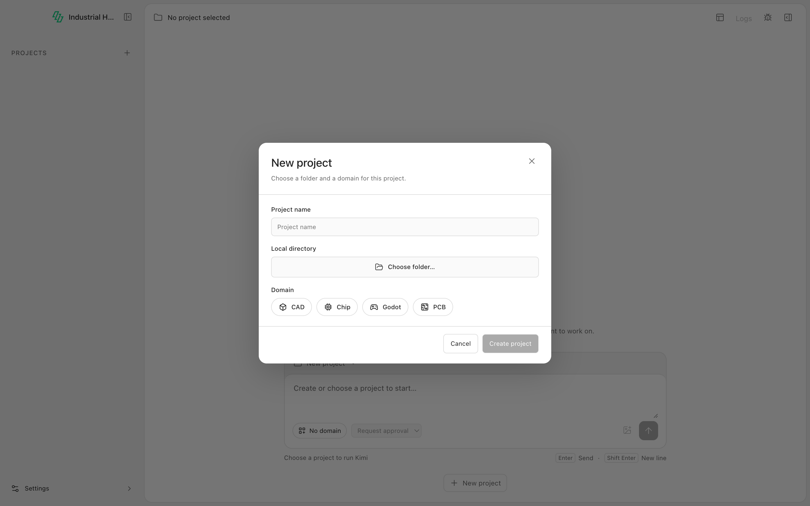

# Domain icons

2026-10-09 · User-approved neutral outline artwork, replacing domain emoji in the desktop UI.



| Presentation identity | Label | Shape |
| --- | --- | --- |
| `pcb` | PCB | Board, pads and traces |
| `chip` | Chip / 芯片 | Pinned package and core |
| `cad` | CAD, including FreeCAD projects | Isometric solid |
| `godot` | Godot | Game controller |
| `cuda` | CUDA | Parallel compute array |
| `industrial-software` | 工业软件复刻 | Overlapping software windows |
| `physics-chemistry` | 物理化学仿真实验 | Flask and connected particles |

The last two identities reserve artwork only; they do not create selectable domains,
install Packs or declare executable capabilities. Missing and unknown identities use
the generic grid icon, including IDs inherited from JavaScript object prototypes.

The shared `@industrial-agent-harness/viewer-builtin/domain-icon` presentation export
owns all seven SVG paths and their lookup. Desktop passes the existing domain ID;
no domain dispatch is added to Core, Broker, CLI or the desktop adapter.

```tsx
<DomainIcon domain={domain.id} size={16} />
```

The artwork uses a 20 × 20 viewBox, 1.5-unit round strokes and `currentColor`.
Compact sidebar and chat labels use 14 px, project choices and the selected domain
use 16 px, and Pack cards use 22 px. Icons retain adjacent translated labels and
are hidden from assistive technology. The native project-domain select retains
text-only options and keyboard behavior, with the selected icon positioned beside
its text. Theme colors continue to come from existing desktop tokens.

Surfaces: project sidebar, new-chat domain pill, project creation, project details,
first-run Domain Manager and capability-center available/installed Pack cards.
Legacy Pack `emoji` metadata remains compatible with existing consumers; the
desktop no longer renders that field.

All artwork was drawn for this project; no additional icon package or network
asset is required. Runtime React paths are maintained in
`packages/viewer-builtin/src/DomainIcon.tsx`; the image above is the approved design
reference, not a second runtime asset source.

## Verification

On macOS Apple Silicon: desktop TypeScript/production build, architecture contract
(11 tests), architecture suite (24 tests), real Electron `test:ui`, and industrial
core integration (9 tests) passed. The core suite used the existing prepared EDA
Python through `INDUSTRIAL_HARNESS_EDA_PYTHON`; a fresh checkout does not include
that runtime's virtual environment. Electron screenshots confirmed the project
choices, selected native dropdown and sidebar, including light/dark themes.
Windows/Linux packaged execution was not rerun for this presentation change.


