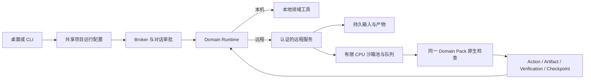

# 内置知满远程运行：首期接入

2026-10-06：源码已接入共享远程 Runtime、桌面入口和 CLI。H200 内网服务的真实 RTL 检查及产物回读已验证。官方公网地址和登录配置保持空值；这是内部体验能力，尚未开放公网账号登录。

## 用户如何使用

项目详情提供 **本机 / 知满远程（体验）**。选择属于项目，所有对话继承运行位置；审批模式仍属于每个对话。未配置的服务显示“尚未配置”，允许先保存运行位置，无法开始远程执行。

配置就绪后，用户检查连接、选择工程文件、查看上传目的地和文件清单，再确认同步。默认没有选中文件。随后同一文件清单内的内容修改会在下一次任务前同步；增加或删除同步路径需要重新确认。首次同步不自动上传整个目录。

聊天附近显示准备、排队位置、运行、收集结果和结束状态，可以取消特定任务。它显示执行状态；工程是否通过由单独的 VerificationResult 决定。用户不选择机器、镜像、CPU、Pod 或 namespace。

全局 MCP 与技能设置显示内置服务卡片，名称和服务地址由应用/部署配置提供。原有 stdio/HTTP/SSE 注册放到折叠的“自建服务与其他 MCP”，用于高级配置。

## 共享边界



`RemoteSettings` 在共享配置目录保存按规范目录与 Domain 绑定的运行位置、远端项目引用、授权路径和快照摘要；不保存访问令牌。Desktop 的窄 IPC 与 CLI 共用这个模块。`createProjectRuntime` 在加载本地领域插件之前分流远程模式；远端模式只保留本地受控文件读写，专业工具由服务的已准入 profile 提供，本地声明任务和外部 MCP 暂不组合进远程模式。

`RemoteRuntime` 位于 domain-runtime，保持原有 `inspect / descriptors / describeTool / execute / readArtifact / cancel` 接口。专业操作通过服务 0.2 的控制 API 构造规范请求，自动附带快照、能力摘要、当前 State、request ID 和审批 grant；模型无需制造网络协议 JSON。MCP 接口继续供通用客户端互操作，已有手动注册的 MCP 响应仍是未验收观察。

服务返回的规范事实保留原始身份；客户端用现有 contracts 校验项目、动作、产物、验证证据与 Checkpoint，再下载并核对大小和 SHA-256，写入本地只读 CAS。响应中的文件路径不会作为本地写入路径。同步输入后服务返回新的 State；旧通过结果和工件仍保留，但不能证明修改后的工程。

## 数据和恢复约束

- 仅 HTTPS，开发时允许 loopback HTTP；禁止携带凭据的 URL 和重定向。
- 凭据只在宿主读取。Agent 进程环境排除服务凭据引用；模型、Renderer、同步清单和提交 journal 不包含令牌。
- 上传上限为 256 个文件、总量 8 MiB，拒绝路径穿越、符号链接、硬链接、私钥及常见凭据文件/字段。文件选择和检测不是通用敏感信息识别器；工程内其他保密数据仍以用户确认的范围为准。
- 上传确认绑定目的地、项目、文件摘要并在五分钟后失效；文件在确认后变化则需重新审核。
- 服务身份和远端项目被固定，运行中的 UI 配置不能重定向任务。服务/绑定变化使 Runtime 和原生会话配置失效。
- 提交前保存 request 身份。断线或宿主退出后按 request/job 查询，不重放提交；查不到的未知结果仍保留未知，不能假定未执行。
- 取消绑定显示的 request/job。取消或执行完成不等于工程通过；恢复时还需校验并导入事实。

服务端维持现有有限 CPU 沙箱池、排队上限及项目隔离。存储独立于短生命周期计算环境；本次没有扩大并发或新增调度层，也没有重新定义 Domain Pack 发布物。

## 发布配置与暂留空项

`packages/harness-core/src/remote-defaults.json` 随程序发布，目前为：

```json
{
  "serviceUrl": null,
  "credentialEnv": null,
  "loginUrl": null
}
```

`loginUrl` 仅为后续认证接入预留，当前不发起 OAuth 登录。内部体验使用现有逐 principal 的可撤销 Bearer 凭据。操作者可以在 `INDUSTRIAL_HARNESS_CONFIG_DIR/remote-settings.json` 的 `service` 字段提供 `serviceUrl` 与 `credentialEnv`（环境变量名称），或用 `INDUSTRIAL_REMOTE_SERVICE_URL` / `INDUSTRIAL_REMOTE_CREDENTIAL_ENV` 覆盖。令牌由对应的宿主环境变量提供，不能写入默认配置或仓库。首次认证检查固定 `serverId`。

仍待提供/接入的部署项：公网 HTTPS 地址与证书、用户登录协议和回调、邀请入口、逐用户凭据交付及试用额度。配置空值不会伪装成已连接。服务实例替换或迁移需明确重新绑定，不自动把旧项目投递到另一服务。

## CLI

```sh
industrial-harness remote status
industrial-harness remote connect
industrial-harness remote use --project-dir /path/to/project --domain DOMAIN --location remote
industrial-harness remote sync --project-dir /path/to/project --domain DOMAIN --file eda.yaml --file rtl/counter.sv --file tb/counter_tb.sv
# 看过清单并授权后，显式确认上传；只有这一命令会提交上述文件。
industrial-harness remote sync --project-dir /path/to/project --domain DOMAIN --file eda.yaml --file rtl/counter.sv --file tb/counter_tb.sv --confirm-upload
industrial-harness run --project-dir /path/to/project --domain DOMAIN --task '运行远程验证' --approval approve
industrial-harness remote task --project-dir /path/to/project --domain DOMAIN
industrial-harness remote cancel --project-dir /path/to/project --domain DOMAIN
```

`--scope-only` 仍为静态能力预览，不连接服务、不建立执行权限。模型 API 配置沿用现有 CLI 选项；远程服务连接与模型服务配置彼此独立。

## 验证范围

共享协议测试覆盖空配置、无上传预览、确认失效、路径/凭据排除、审批与 Scope 拒绝、避免加载本地领域插件、保留规范身份、产物篡改、过期 State 和未知结果恢复。真实原生子进程测试检查服务凭据不进入 Agent 环境。桌面自测覆盖入口、未配置状态、高级表单折叠及项目偏好。

H200 内网的 `chip.rtl.verify` 已执行原生断言测试并返回真实 VCD，客户端核对并保存产物；CLI 的 pinned Kimi 与受控模型也走同一宿主回调链路。受控模型测试验证接入，不评价模型能力。当前只验证 macOS Apple Silicon 客户端连接 H200 Linux 服务；其他客户端平台、公网、登录及其他远程领域仍未验收。
