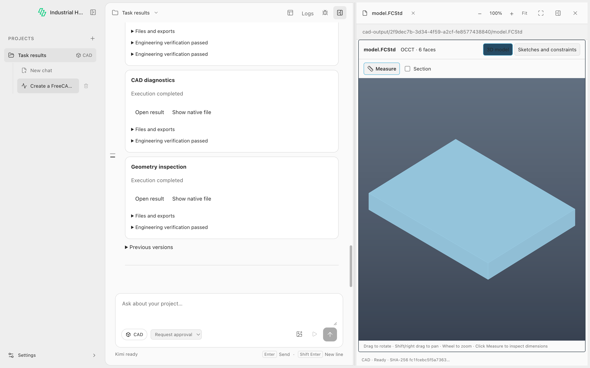

# Task results / 任务成果（#66）

2026-10-09. Results are application presentation metadata collected automatically from actual tool outputs. CLI and Desktop use the same `TaskService` records. Selection is optional; omitting it, interrupting a request, or failing a later operation does not remove earlier outputs. Execution completion, file availability and engineering verification remain separate.

## User behavior

Desktop shows a compact result row as soon as a producer declares a valid group. Rows share one container with thin separators: title/open actions on the first line, execution status/file count/check summary on the second. File lists and individual check evidence expand on demand; failure and content warnings stay visible. Non-preview results whose primary artifact is explicitly included in another result’s explicit file set share a collapsed “Supporting results” section. Each row identifies its producing step, so several reports with the same title remain distinguishable. Matching titles alone never merge results. Selected results (including historical selections), failed execution/checks, insufficient evidence and changed/unavailable/unchecked content stay in the main list. All group identities and files remain available. The main entry opens the recorded version through Viewer Registry or the source-file canvas; “Show native file” reveals the validated native file in its folder. “Files” exposes actual attachments, including reports. Checks show their canonical outcome and reason. A report never silently replaces a model. Previous versions collapse only after an explicit, content-bound replacement; parallel designs remain separate cards. Older producers without groups retain their recorded Action/output entries.

A live foreground request may open one preview after all related work is ready, once per request. There must be exactly one eligible candidate (or one explicitly selected group), a successful producing Action, and a supported read-only embedded Viewer. CAD and document plugins opt in; other plugins do not implicitly opt in. Manually opening a file, changing tabs/chats/projects, starting another request, choosing historical results, failure/cancellation, parallel outputs, background completion and historical replay suppress automatic opening. No external program is launched automatically. Viewer loading still checks source and companions and can fail independently of execution or verification.

Partial output stays visible with request/Action failure status. A valid native file can still be revealed if its preview companions are unavailable; preview opening requires all companions. Missing files or changed contents produce an explicit error; the recorded path is never silently rebound to new bytes. Historical checks remain historical facts and do not certify changed bytes. Display freshness hashes files up to 64 MiB; larger files show an unchecked state and are still fully digest-checked when opened. An unavailable Viewer leaves manual file/source entries; native software launch remains a separate path.

Reading history does not initialize execution Runtime or load Packs. Empty/text-only chats need no industrial store; saved result events use existing canonical records through a read-only cursor, including cached remote facts before remote setup is ready. Within one history call, cumulative events reuse file validation by canonical Artifact ID. The cache is discarded at return: subsequent reads detect changed bytes, and opening a result independently validates the source and companions. The 32-file/32-MiB regression fixture now reads 32 MiB per history call, compared with 528 MiB without reuse.

## Producer and host contract

`packages/contracts/src/results.cjs` owns strict, version `'1'` display schemas, separate from canonical Artifact/Action/Verification records. A minimal producer declaration is:

```json
{
  "artifacts": [{ "localId": "document", "file": "outputs/notes.txt", "kind": "text" }],
  "presentation": {
    "schemaVersion": "1",
    "groups": [{ "key": "document", "title": "Notes", "primary": "document" }]
  }
}
```

The example is protocol documentation, not a product fixture. Artifact collection first assigns canonical IDs and content identities. Domain Runtime then maps producer-local names from the same collected Action to `primaryArtifactId`, optional `previewArtifactId`, `attachmentArtifactIds` and `companionArtifactIds`. Duplicate/unknown names, foreign Actions, invalid versions and forged input relationships discard display declarations with diagnostics; actual Action/Artifact/Verification facts remain available.

Optional `supersedesInput: {relativePath, sha256}` references an exact recorded input. Optional `checks: [{input: {relativePath, sha256}, outputs: [localId]}]` attaches the current Action's actual verification/report to that exact version. Inputs must match canonical `action.inputHashes`, or a declared staged input snapshot whose bytes also match the project input. Ambiguous aliases never fold. There is no filename, suffix, timestamp or last-output ranking. Missing verification is valid for a generic file and is never upgraded to `passed`.

TaskService binds project/chat/request identities and creates `${actionId}:${key}` group IDs. Each Action can belong to only one request. A user request can contain several independent industrial `runId`s; the collector uses the captured chat turn instead. `results-changed` persists compact references and selection in ChatStore, with stable event identities and transactional deduplication. Read models resolve canonical facts rather than storing copied acceptance claims. `results-ready` indicates settled presentation; native Kimi `finished` and application `completed` both count as request completion. Background readiness cannot arm preview. Late Action callbacks retain the context captured before awaiting tool execution and cannot change a newer request's selection or Broker scope.

## Optional Agent tools and CLI

The existing authenticated Kimi MCP bridge registers `list_results` and `select_result` as application tools even without an industrial Runtime. `list_results` returns current groups, historical group summaries and `revision`. `select_result({groupIds, revision, historical?})` only changes emphasis; it cannot submit paths, hashes, checks or acceptance claims. Multiple IDs support comparison. Unknown, cross-request, superseded current, changed-content and stale-revision choices return recoverable errors. Explicit `historical: true` preserves historical labels and permits comparing earlier versions; it cannot restore overwritten bytes. The tools create no industrial Action, State or Checkpoint and add no agent loop, extra model turn or MCP service.

CLI emits `results_changed` and `results_ready` JSONL rows with the same group IDs, selection, revision and bound Artifact references as the Desktop-facing API, and includes `results` in its terminal record. File entries contain project-relative paths, actual Artifact IDs and digests. CLI has no Electron or Viewer UI dependency. `TaskService.results(entry, turnId)` reads the shared view; `openResult(entry, request)` validates chat/turn/Action/group membership, project confinement and source/companion digests before returning a recorded file.

## FreeCAD owner integration

Harness consumes immutable Domain Packs commit `b9759342cace66df0be0c4559b7c24fb28ea07d9` (package 0.5.2, FreeCAD `1.1.4-pack.7`); all deployable roots and pnpm integrity agree. FreeCAD semantics and Skill guidance are maintained only in that owner. Build/edit declare one model group (FCStd, STEP/STL attachments, BREP/manifest/recipe/sketch companions) and a separate diagnostic group. The preview entry is FCStd so the existing Registry opens its exact manifest-bound BREP through OCCT. Inspect declares a report and check references to its actual input, leaving the model as the main preview. Failed/cancelled operations declare only readable files actually produced and no successful replacement. Generic `project.files.apply` declares only its explicitly changed files, without scanning the project.

The recorded Artifact resolver and IndustrialResult component reuse [PR #52](https://github.com/Zhiman-BJ/industrial-agent-harness/pull/52); resolution now lives below Desktop in the application package. #52 was open when this work started and is not merged by this change. Its overlapping result-opening changes must be reconciled before merging it later. Installation and first-run release work remain under #60.

## All-domain expansion preparation

The owner maintains the [per-domain declaration catalog and implementation plan](https://github.com/Zhiman-BJ/industrial-domain-packs/blob/b9759342cace66df0be0c4559b7c24fb28ea07d9/docs/result-presentation-plan.md) and [machine-readable review examples](https://github.com/Zhiman-BJ/industrial-domain-packs/blob/b9759342cace66df0be0c4559b7c24fb28ea07d9/docs/result-presentation-examples.json). These are proposals, not active runtime configuration. They cover Chip, PCB, Godot, CAD (FreeCAD and skill-only two-dimensional CAD) and CUDA in the owner's current five-domain/six-Pack inventory. The catalog records the pre-rebase consumer baseline; the current Harness pin includes CUDA support already integrated on main, while CUDA task-result declarations remain proposed.

Preparation identified a shared version-binding gap: PCB/Godot outputs use immutable run snapshots while subsequent edits/checks use mutable project paths. Current path-and-digest matching cannot equate them. An explicit, verified working-file-to-snapshot relationship is required; digest-only aliasing would incorrectly merge parallel designs. CUDA additionally needs an exact submitted-source manifest/snapshot, and two-dimensional CAD needs an actual Runtime producer/readback entry. The plan sequences these changes and their native, CLI/Desktop, compatibility and release tests. Preparation itself changed documentation only; the subsequent main rebase advances the consumer pin to retain both main's CUDA support and the FreeCAD declarations. Verifiers, source locks and automatic-preview policy remain unchanged.

## Acceptance and limits

Validated on **macOS Apple Silicon (darwin-arm64), source workspace**, Node 26.10.0, pinned Kimi Code 2.1.1 and official FreeCAD 1.1.4. This feature has not been qualified in a newly packaged installer, Linux/Windows native CAD, or remote execution. Existing platform claims are not expanded.

Rebase validation (2026-10-09): the branch is based on main `e5236e54323d1aade050d553c67d2e175a2b4058`, retaining its CUDA consumer and subagent identity glyphs. All three deployable roots pin owner `cf72a46b6b4ba927b091ded71b2d52d227db0351`; frozen installation, content integrity and the CUDA consumer regression pass. FreeCAD owner sources are byte-identical to the original `e6556e41cd34aa87b32d64391b48084ce7003f29` acceptance release. Portable CI passes 336 tests with its one declared optional KLayout rendering skip; architecture contract (11), architecture (24), release (17), both real-native result suites, desktop build/typecheck, formatting and Electron result/subagent selftests pass. The earlier live-model evidence retains its original Pack identity.

| Evidence | Exercised behavior |
| --- | --- |
| `pnpm test` | Contracts, bound outputs, ordinary file results, persistence/restart, duplicate registration, exact-version/late/background isolation, stale/multiple/historical selection, changed-content opening, shared CLI events and preview policy; unconfigured remote chat/history, read-only record lifecycle, per-read validation reuse and subsequent changed-byte detection |
| `pnpm test:architecture-contract`, `pnpm test:architecture` | Existing ownership gates unchanged; no added policy exceptions |
| Owner `npm test`, `npm run lock:check`, `npm run test:architecture-contract`, locked real stdio MCP smoke | Owner production declarations, partial/failure cases, inventories and source identity |
| `pnpm test:results` with `INDUSTRIAL_HARNESS_FREECAD_CMD` | Real FreeCAD generation/edit/inspection, two-design comparison, report selection, exact companion mismatch rejection; pinned Kimi with controlled model responses through the authenticated MCP bridge, without `select_result` |
| Desktop `test:results` after `build` | Real native output → live result cards → Registry → rendered OCCT BREP, toolbar/wheel/pinch/Fit/fullscreen, manual report opening, focus preservation during another request and history replay; compact rows, expandable details, dark theme and 640px layout |
| Existing `freecad-runtime.test.cjs`, `pnpm test:release` | Native geometry, failure/cancellation, installed Pack consumption, existing Kimi continuation and release integrity |

The source Electron acceptance screenshot shows compact result rows beside the native BREP Viewer. Default rows measured 62.5 CSS pixels high at the tested desktop size; file and check details expand on demand. The same acceptance run checks dark theme and the 640px minimum-width layout without horizontal result-row overflow:



[Expanded reports with source steps](evidence/task-results-desktop-details-20261009.png) · [Dark theme](evidence/task-results-desktop-dark-20261009.png) · [640px layout](evidence/task-results-desktop-narrow-20261009.png)

The new native test files join the existing native CI test catalog; architecture checker, policy and workflows are unchanged. Controlled responses establish tool/UI integration, not general model planning quality. A separate real-model run used **MiniMax-M2.7-highspeed** through the configured model API: one request built a 40×20×5 mm plate, the next performed consecutive width edits to 30 and 35 mm and inspected the final version. All four canonical verifications passed; build/edit model IDs and explicit supersession were retained. A redacted, compact record is in [the evidence JSON](evidence/task-results-20261009.json). No endpoint, credential, hidden reasoning or raw conversation is committed. This single scenario is evidence of that run, not a benchmark of model selection reliability.

## 中文使用说明

本轮工具产生文件后，紧凑成果条目自动出现，无需 Agent 记住收尾调用。默认两行展示标题、打开操作、执行状态、文件数量和检查摘要；文件和检查详情按需展开。主入口预览对应版本，“文件”可打开真实附件，文件夹图标定位可取走的原生文件。明确作为其他成果附件的辅助结果统一收在“附件与报告”中，展开后用步骤区分多份同名报告；不按标题去重。失败、证据不足、内容变化及用户明确选中的结果保持直接可见。模型与诊断报告分开；只有明确替代关系才折叠旧版本，并列方案全部保留。检查摘要只说明所引用版本的实际证据，执行结束或能预览不等于工程检查通过。

当前前台请求结束、相关工作就绪且只有一个明确支持的只读预览时，最多自动打开一次。已经手动换文件／标签／对话、查看历史版本，或任务失败、取消、仍在后台、多方案不明确时，只更新成果。重启和历史回放不自动打开。文件变化、附件不可读或 Viewer 不可用会明确反馈；失败后的部分文件仍可查看，不冒充完成。

读取历史不初始化执行 Runtime 或加载 Pack，远程配置未完成也能新建／读取聊天，并查看已缓存的成果记录。单次读取按 Artifact 身份复用文件校验，下一次读取及打开文件仍重新校验；32 个文件共 32 MiB 的回归用例将读取量从 528 MiB 降至 32 MiB。

需要对比方案或突出诊断时，Agent 可按需调用 `list_results`／`select_result`，选择已登记的组；默认可见性不依赖它。CLI 获取同一成果身份、分组、选择和检查状态。实际验收限上表的 macOS arm64 源码运行态，未新增跨平台或安装包支持承诺。
